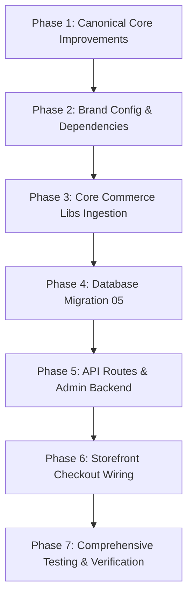

# Commerce Core Integration Plan — Vial Foundry

**Author**: Antigravity Principal Integration Engineer  
**Target Repository**: `C:\Users\omino\Documents\VialFoundry`  
**Source Repository**: `C:\Users\omino\Documents\peptide-commerce-core`  
**Date**: August 16, 2026  
**Status**: Ready for Implementation  

---

## 1. Executive Summary

This document establishes the architecture, dependency matrix, schema reconciliation, and step-by-step implementation plan for integrating the reusable backend engine from `peptide-commerce-core` into the **Vial Foundry** production application.

The goal is to equip Vial Foundry with proven ecommerce order math, manual payment workflows, timing-safe HMAC admin authentication, affiliate tracking & commissions, financial reporting ledgers, and transactional email infrastructure, while strictly preserving Vial Foundry's bespoke high-tech dark theme, design system, catalog presentation, and laboratory branding.

---

## 2. Forensic Audit Findings

### 2.1 What Vial Foundry Implements
* **Framework**: Next.js 14 (App Router) with Tailwind CSS, TypeScript, Framer Motion, Lucide icons.
* **Customer Storefront**:
  - Hero, TrustBand, FoundryStandard, ToolsHub, AgeGate, Footer.
  - Interactive `VialStudioViewer` 3D/canvas product viewer.
  - Interactive `BatchVerificationEngine` and `COAModal` for lot/batch verification.
  - Product catalog (`/catalog`) and detail pages (`/product/[id]`).
  - Client-side `CartContext` with `CartDrawer` slide-out.
  - Informational pages (`/about`, `/contact`, `/quality`, `/affiliates`, `/resources`, `/legal/*`).
* **Existing Admin UI**:
  - Visual dashboard shell (`/admin`, `/admin/orders`, `/admin/inventory`, `/admin/batches`, etc.) backed by in-memory mock state and basic table views.
* **Existing Database**:
  - Supabase migrations (`01_schema.sql` to `04_payments_affiliates.sql`) covering `categories`, `products`, `product_variants`, `batches`, `coas`, `customers`, `orders`, `order_items`, `inventory_transactions`, `discounts`, `affiliates`, `affiliate_conversions`, `email_subscribers`, `contact_requests`, `restock_requests`, `admin_audit_logs`.

### 2.2 What Peptide Commerce Core Implements
* **Admin Security**: Timing-safe HMAC SHA-256 session token cookies (`ADMIN_SESSION_SECRET`), constant-time string comparison, clean route protection.
* **Order Engine & Math**: Authoritative server-side subtotal, discount, shipping, tax, and total calculation in cents. 9-state order lifecycle machine (`new`, `invoice_sent`, `pending_payment`, `paid`, `preparing`, `shipped`, `fulfilled`, `canceled`, `refunded`) with strict terminal refund/cancellation guards.
* **Checkout & Manual Payments**: Idempotent manual order submission pipeline (`X-Idempotency-Key`), Zelle and Venmo instruction renderers, customer snapshotting.
* **Affiliate & Referral Engine**: Short-code alias resolution (`/r/[code]`), cookie attribution, basis-point commission rate calculation, affiliate payout status tracking (`pending_payment`, `pending_payout`, `paid`, `void`, `reversed`).
* **Financial Ledger & Reporting**: Net collected revenue metrics, pending payment tracking, test order (`is_test = true`) and archived order (`archived_at`) separation.
* **Transactional Email Automation**: Resend integration wrapped in try/catch to protect checkout success from external mail delivery failures.
* **Tested Contract Suite**: 155 unit tests verifying all math, status transitions, shipping thresholds, and compliance rules.

### 2.3 Overlapping & Missing Modules
| System Area | Vial Foundry (Existing) | Commerce Core (Source) | Reconciled Direction |
|---|---|---|---|
| Admin Auth | Simple password / client check | Cookie HMAC SHA-256 session token | Adopt Commerce Core HMAC session auth |
| Order Math | Client-estimated subtotal in checkout | Authoritative server-side cents math | Adopt Commerce Core server math |
| Order Model | Simplified `orders` table | Feature-complete `manual_orders` + `manual_order_items` | Integrate `manual_orders` alongside existing tables |
| Checkout API | Basic `orders` insert | Idempotent `POST /api/checkout` with snapshots & email | Wire VF checkout form to robust `/api/checkout` |
| Shipping Math | Flat adapter calculations | Tiered (Standard/Priority/Express) + threshold | Make tiers & thresholds configurable in `config/brand.ts` |
| Promotions | Hardcoded `FOUNDRY10` / `RESEARCH25` | Hardcoded `SAVE10` | Parameterize into configurable `BrandPromoConfig` |
| Affiliates | Basic `affiliates` schema | Full attribution (`/r/[code]`), aliases, revenue ledger | Adopt Core attribution engine with VF brand settings |
| Email Service | Basic adapter | Resend with safe fallback & rich templates | Adopt Core Resend client with VF brand identity |
| COA / Batches | Rich `BatchVerificationEngine` & `COAModal` | Static COA list & viewer | Preserve Vial Foundry's rich batch & COA engine |

---

## 3. Database Reconciliation Plan

Vial Foundry already contains an active schema. To preserve all existing products, batches, and records without data loss:
1. Retain existing `batches`, `coas`, `categories`, `products`, `product_variants`, `customers`, and `orders`.
2. Add migration `supabase/migrations/05_commerce_core.sql` to establish:
   - `manual_orders` (with idempotency `submission_key`, JSONB snapshots, affiliate attribution, test/archive flags).
   - `manual_order_items` (line-item snapshots with cents pricing).
   - `manual_payment_notes` (admin internal payment audit trail).
   - `affiliate_aliases` (legacy or alternate partner codes).
   - `affiliate_clicks` (referral link click logs).
   - `referral_revenue` (commission accounting records).
   - `rate_limit_events` (security rate limiting).
   - `admin_audit_log` (system-wide change audits).
3. Apply Row Level Security (RLS) policies granting anonymous `SELECT` to public data and `INSERT` to checkout/inquiries, while restricting administrative tables to `service_role`.

---

## 4. Brand Configuration Architecture

All brand settings are centralized in `src/config/brand.ts`:
* **Brand Identity**: Vial Foundry / Vial Foundry Laboratories LLC / `vialfoundry.com`
* **Support & Notifications**: `support@vialfoundry.com`, `orders@vialfoundry.com`, `admin@vialfoundry.com`
* **Payment Methods**:
  - Manual Invoice: Enabled
  - Zelle: Recipient `Vial Foundry LLC`, email `payments@vialfoundry.com`, memo `VF Order #[ORDER_NUMBER]`
  - Venmo: Handle `@VialFoundry`, note `Include VF Order #[ORDER_NUMBER]`
* **Shipping Tiers**:
  - Standard Ground (3-5 Days): $15.00 (Free at >= $200.00)
  - Priority Air (2-Day): $35.00
  - Express Overnight (1-Day): $65.00
* **Affiliate Configuration**:
  - Cookie Name: `vf_ref_partner` (30 days)
  - Default Commission Rate: 1000 bps (10.0%) or brand configured
  - Promo Overrides: Configurable per promotion code
* **Promotion Configuration**:
  - `FOUNDRY10`: 10% subtotal discount
  - `RESEARCH25`: $25.00 fixed discount for orders >= $200.00

---

## 5. Implementation Phases

### Phase 1: Canonical Core Improvements in `peptide-commerce-core`
1. Abstract `lib/promotions/` to support configurable promo codes dynamically.
2. Abstract `lib/manual-orders/shipping.mjs` to consume `shippingOptions` and `freeShippingThresholdCents` from brand configuration.
3. Validate that 155 unit tests pass in `peptide-commerce-core`.

### Phase 2: Brand Configuration & Setup in `VialFoundry`
1. Add `resend` to `package.json` dependencies if missing.
2. Create `src/config/brand.ts` with complete Vial Foundry parameters.
3. Setup `.eslintrc.json` to prevent interactive lint prompts.

### Phase 3: Core Library Integration into `VialFoundry`
1. Copy and adapt `lib/admin/` (`auth.ts`, `orders.ts`, `order-math.mjs`, `reporting.ts`, `ledger.ts`, `audit.ts`, `invoice-operations.ts`).
2. Copy and adapt `lib/manual-orders/` (`shipping.mjs`, `payment-config.ts`, `payment-methods.mjs`, `schema.ts`).
3. Copy and adapt `lib/affiliates/` (`attribution.mjs`, `client-storage.mjs`, `tracking.ts`, `utils.mjs`, `server.ts`).
4. Copy and adapt `lib/email/` (`resend.ts`, email templates with Vial Foundry branding).
5. Copy and adapt `lib/env/sanitizer.ts`.

### Phase 4: Database Migrations
1. Create `supabase/migrations/05_commerce_core.sql` in Vial Foundry.

### Phase 5: API Routes & Admin Backend
1. Ingest `/app/api/checkout/route.ts` with server-side validation and non-blocking email triggers.
2. Ingest `/app/api/admin/login/route.ts` and `/app/api/admin/logout/route.ts` with HMAC session cookies.
3. Ingest `/app/api/admin/orders/*` and `/app/api/admin/affiliates/route.ts`.
4. Ingest `/app/r/[code]/route.ts` for referral link routing and attribution.
5. Upgrade Admin Console pages (`/admin`, `/admin/orders`, `/admin/affiliates`, `/admin/reports`) using real backend hooks while maintaining Vial Foundry's dark glassmorphic UI.

### Phase 6: Storefront Wiring
1. Update `src/app/checkout/page.tsx` to utilize `src/lib/manual-orders/schema.ts`, server-side promo validation, and `/api/checkout`.
2. Ensure referral cookie `vf_ref_partner` is read and sent on checkout submission.

### Phase 7: Verification & Testing
1. Port commerce test runner and unit test suites into `VialFoundry/tests/`.
2. Run `npm test`, `npm run typecheck`, `npm run lint`, and `npm run build`.
3. Perform browser verification across storefront and admin portal.
